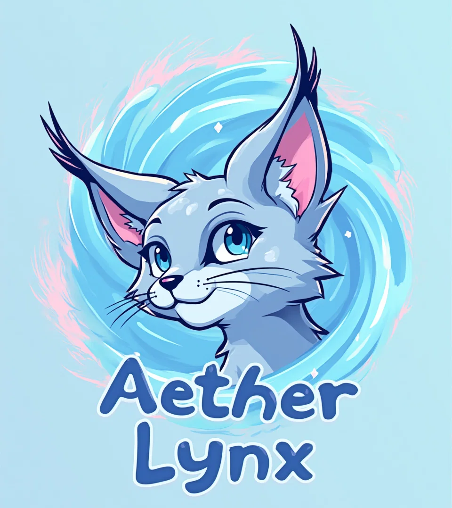

# AetherLynx SDK



AetherLynx SDK es un kit de desarrollo de software diseñado para orquestar y gestionar agentes de modelos de lenguaje a gran escala (LLM) con un enfoque en alta escalabilidad, resiliencia y flexibilidad. Este SDK se inspira en la arquitectura de Kubernetes, pero está adaptado para ser extremadamente eficiente en la gestión de agentes de IA y operaciones de inferencia en entornos distribuidos.

## Características

- **Orquestación de Agentes LLM**: AetherLynx gestiona el ciclo de vida de los agentes, incluyendo la creación, escalado y terminación de instancias de modelos de lenguaje.
- **Reconciliación de Estados**: Basado en un enfoque declarativo, el sistema ajusta continuamente el estado actual para alinearlo con el estado deseado.
- **Alta Escalabilidad y Disponibilidad**: Diseñado para manejar grandes volúmenes de tráfico mediante la autoescalación y balanceo de carga.
- **API gRPC y REST**: Interfaz robusta para interactuar con los agentes y el orquestador.
- **Integración con Sistemas Transaccionales**: Se integra de forma nativa con sistemas transaccionales, permitiendo respuestas enriquecidas en tiempo real.

## Requisitos

- **Rust**: Versión >= 1.50
- **Python 3.8+**: Para los agentes basados en modelos de lenguaje.
- **Cargo**: Para la compilación y gestión de dependencias en Rust.
- **vcpkg**: Para la gestión de dependencias de sistema en Windows (opcional).

## Instalación

### Paso 1: Clonar el repositorio

```bash
git clone https://github.com/your_username/aetherlynx-sdk.git
cd aetherlynx-sdk
